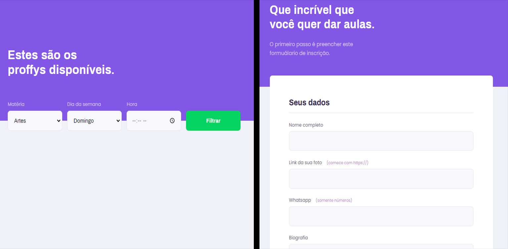

<div align="center">
    
    <br>
    <div>
        
        
    </div>
    <h1>Proffy 👨‍🏫</h1>
</div>

## 🖥 Preview



<hr>

## 📖 Sobre
<p>
    Este é um projeto desenvolvido durante a <a target="_blank" href="https://nextlevelweek.com/">Next Level Week</a>, realizada pela <a target="_blank" href="https://rocketseat.com.br">@Rocketseat</a> durante os dias 03 e 09 de Agosto de 2020.
    <br><br>
    O projeto tem como objetivo conectar pessoas dispostas a ensinar com outras dispostas a aprender. O sistema se resume em uma plataforma web que recebe cadastros contendo informações dos Proffys (ou professores), ao mesmo passo que os alunos podem pesquisar por professores cadastrados de acordo com suas necessidades, especificando a disciplina de interesse e os horários de disponibilidade.
</p>

<hr>

## 🛠 Tecnologias Utilizadas
As seguintes linguagens e ferramentas foram utilizadas neste projeto:
- [HTML]
- [CSS]
- [JavaScript]
- [Node.js](https://nodejs.org)
- [Nunjucks](https://mozilla.github.io/nunjucks/)
- [SQLite](https://sqlite.org)

<hr>

## 👨‍💻 Como executar o projeto
```bash
# Clone este repositório
$ git clone https://github.com/rickson-lima/nlw-proffy

# Acesse a pasta do projeto
cd nlw-proffy

# Instale as dependências
npm i

# Execute o servidor
npm run dev
```

Por fim, abra seu navegador na URL ```http://localhost:5000```
<br>
Você também pode alterar a porta de acesso do localhost em ```src/server.js```
